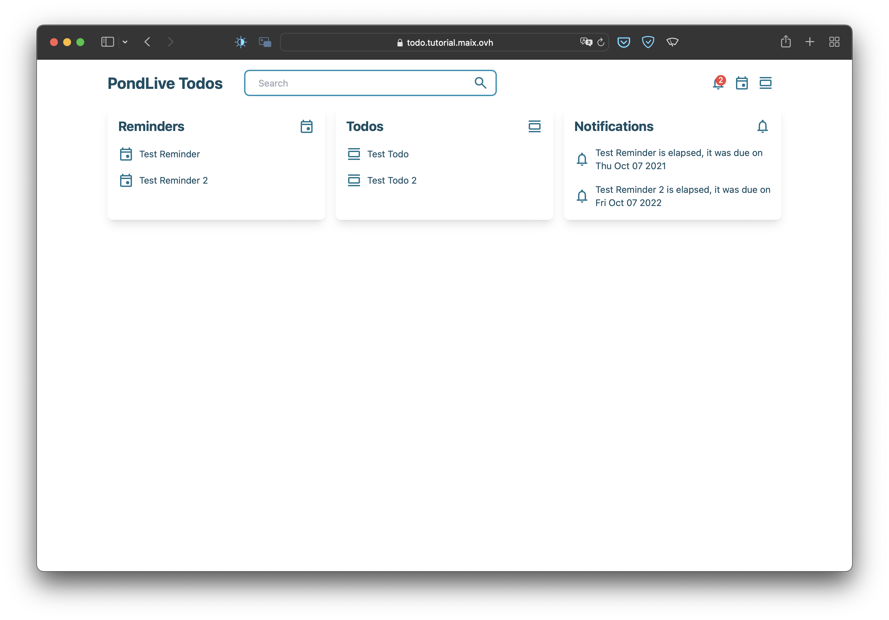
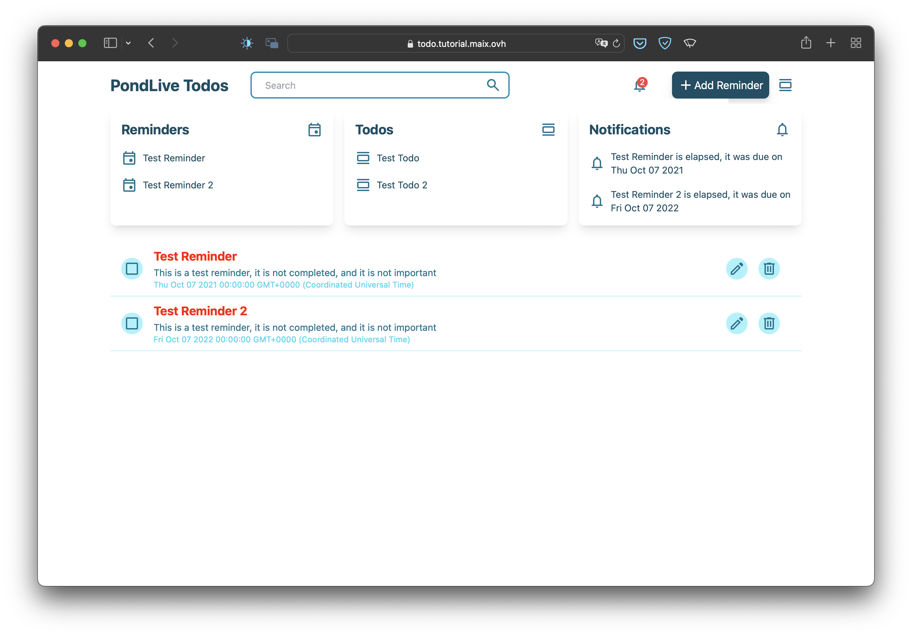
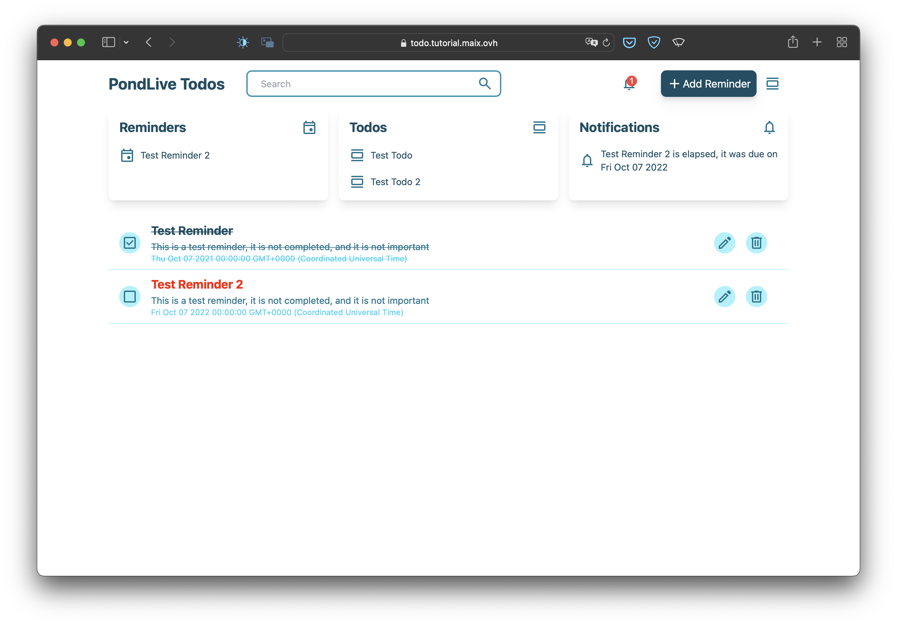
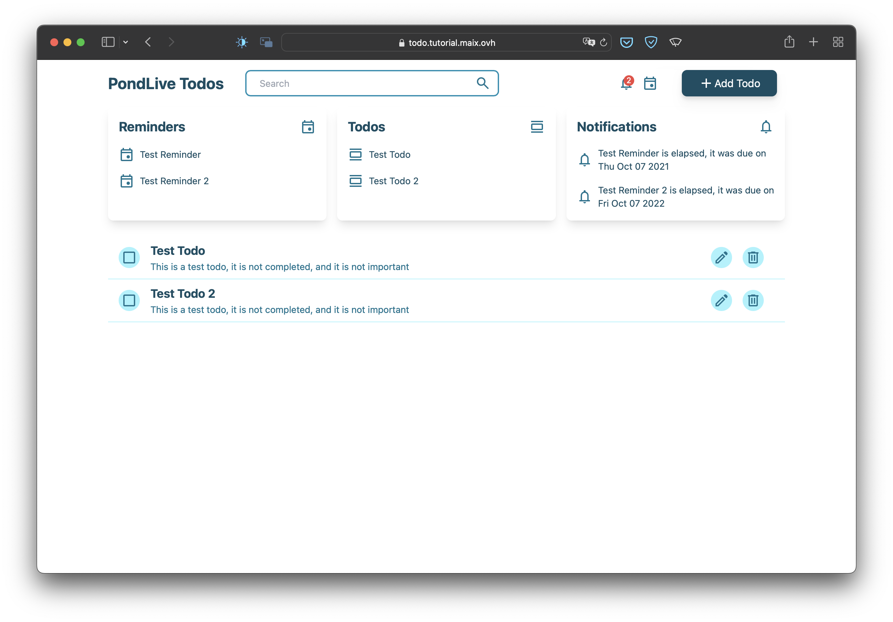
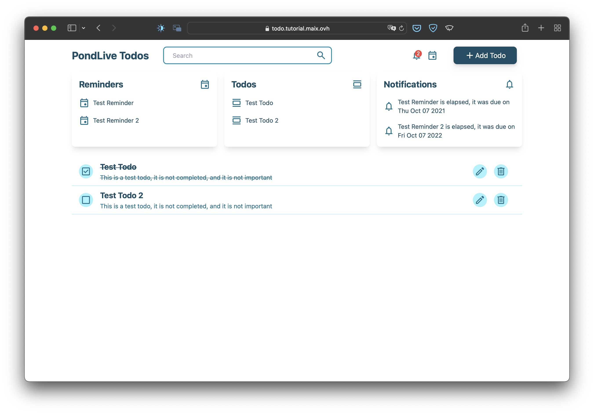

# PondLive Todo

This is a simple todo list app that uses PondLive to render and manage the todo list between the server and the client.

## Running the app

To run the app, you need to have [Node.js](https://nodejs.org/en/) installed. Then, run the following commands:

```bash
npm install
npm start
```

## images







